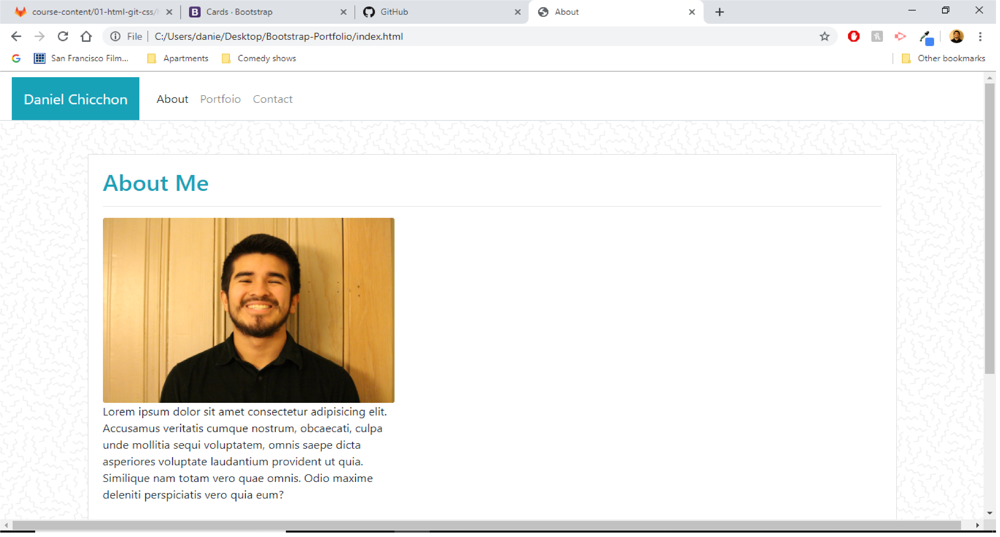
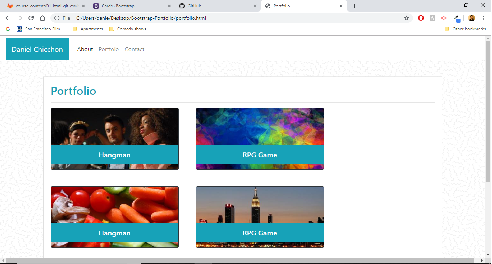
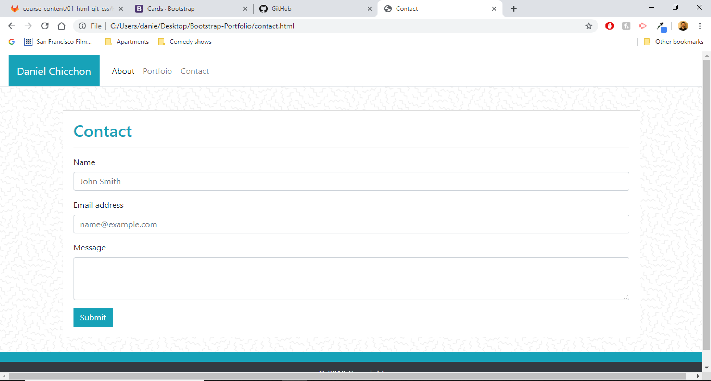

# Bootstrap-Portfolio
## Site Screenshots

## Technologies Used
- [Visual Studio Code](https://code.visualstudio.com/)
- [Git](https://git-scm.com/)
- [GitHub](https://github.com/)
- [Google Chrome](https://www.google.com/chrome/)
- [Bootstrap](https://getbootstrap.com/)

## Summary
The purpose of this homework assignment was to use the bootstrap components with the portfolio that was made with the last assignment. Learning how to use bootstrap helps workflow by using previously made style formats available open source.

## Steps
1. I made sure to use the layout given by the bootstrap webisite first. This allows me to connect my html document to the bootstrap cdn.

2. I searched for components like cards and navbars to add to my html.

3. I modified the components that I used by referring to the utilities page on Bootstrap to allow me to customize my webpage.

## My Links
- [Github](https://github.com/dchicchon)
- [LinkedIn](https://www.linkedin.com/in/danielchicchon/)
